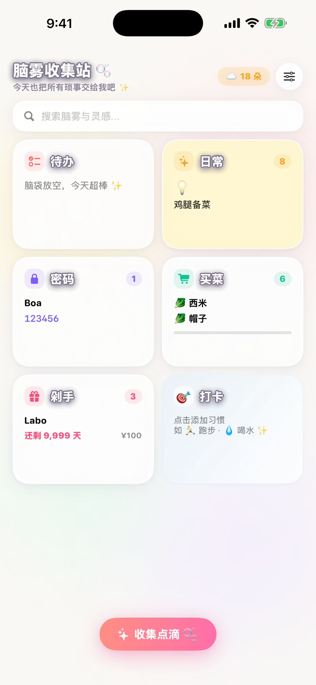
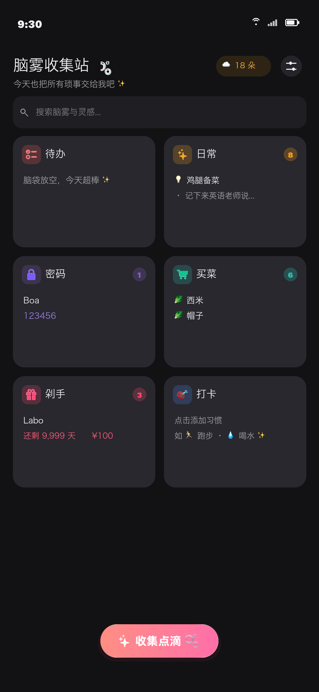
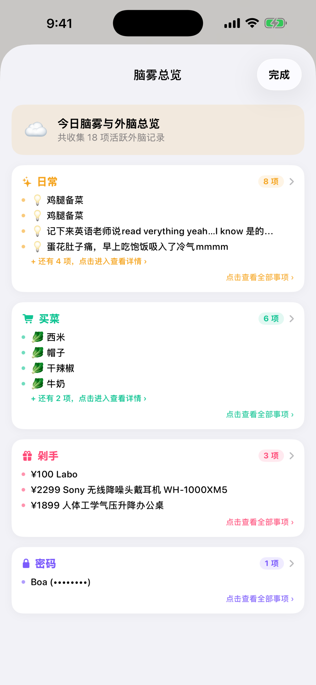
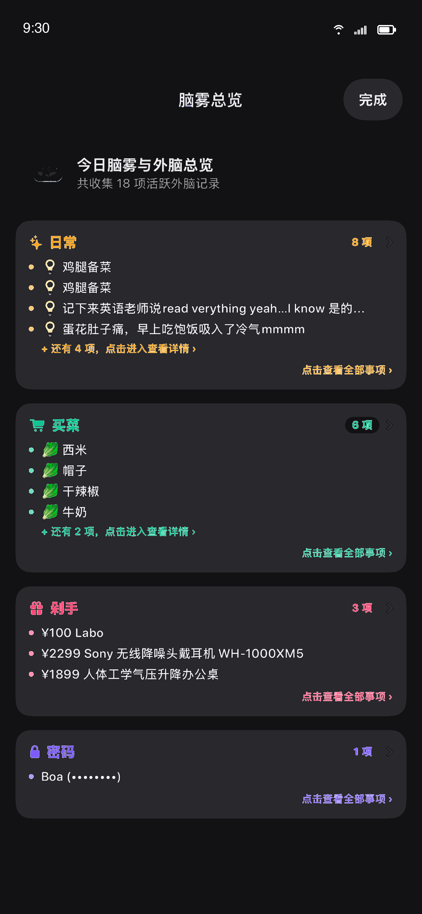
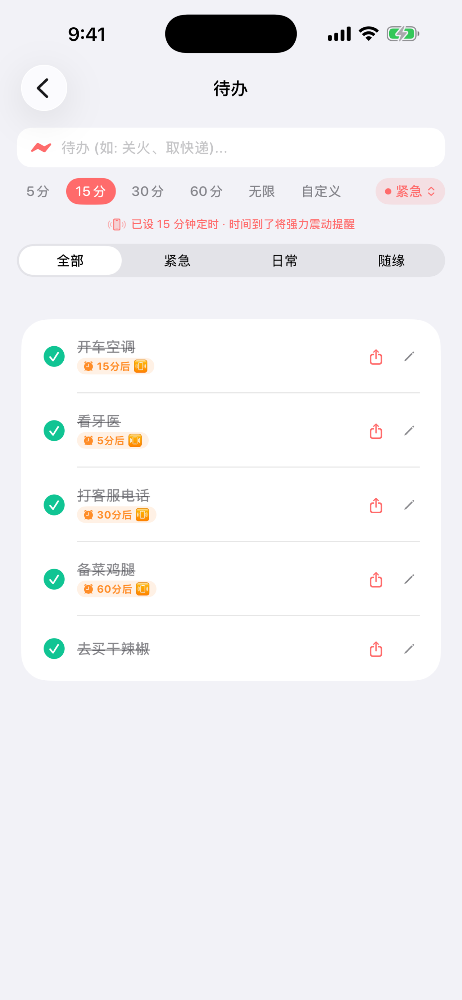
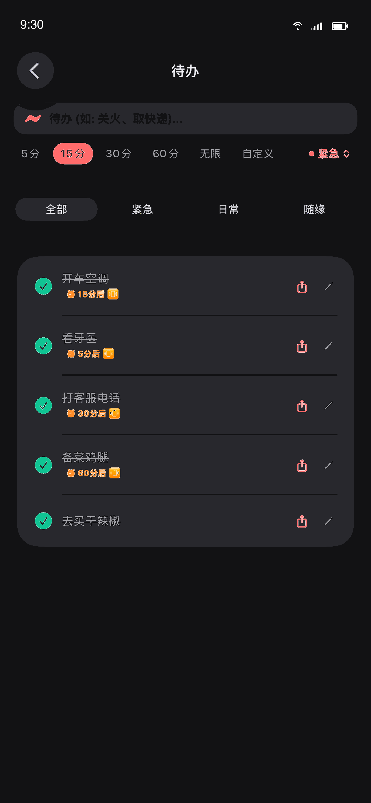
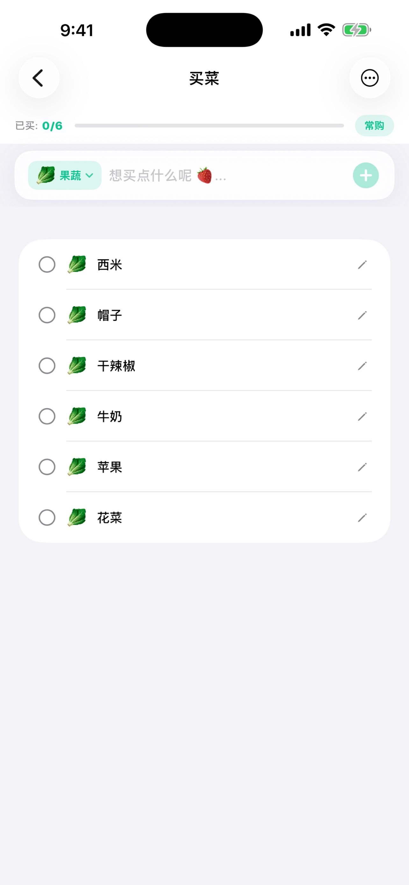
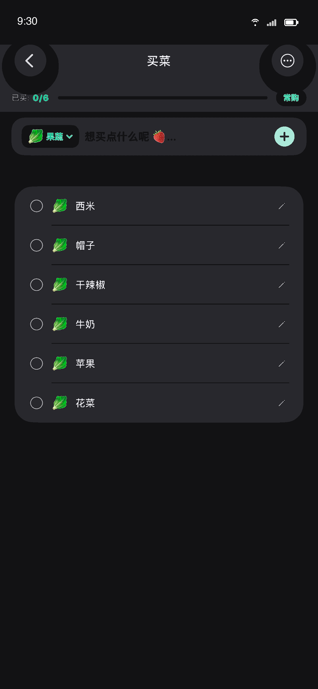
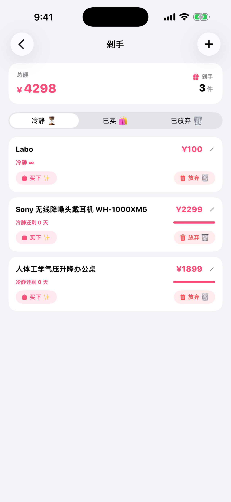
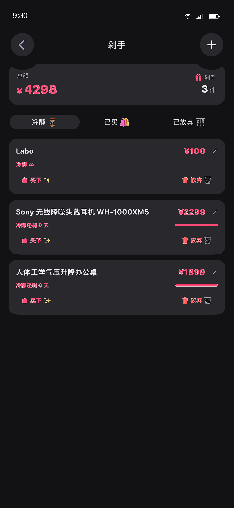

# 🧠 Brain Sticky (脑雾收集站)

<p align="center">
  
</p>

<p align="center">
  <b>A Minimalist, Privacy-First Personal Second Brain & Micro-Habit Hub.</b><br>
  <i>Dual-Platform Native Production Application engineered with Swift/SwiftUI for iOS and Kotlin/Jetpack Compose for Android.</i>
</p>

<p align="center">
  <!-- iOS Badges -->
  <a href="#-ios-implementation"></a>
  
  
  
  <!-- Android Badges -->
  <a href="#-android-implementation"></a>
  
  
  
  <!-- Privacy Badges -->
  
  
</p>

---

## 🚀 Dual-Platform Release & Store Status

**Brain Sticky** is engineered from the ground up as a **purely native dual-platform app** (not a hybrid webview wrapper). Both platforms share 100% UI and functional parity while strictly adhering to platform-native HIG (Human Interface Guidelines) and Material 3 design principles.

| Platform | Native Technology Stack | Target / SDK | Production Release Status | Current Release Track |
| :--- | :--- | :--- | :--- | :--- |
| 🍏 **iOS** | **Swift 5.10** + **SwiftUI** + Combine | iOS 17.0+ / iPadOS / macOS | **v1.2.6 (Build 1)** | **App Store** (Ready for Distribution) |
| 🤖 **Android** | **Kotlin 2.0** + **Jetpack Compose** + Material 3 | Android 7.0 - 15 (minSdk 24, targetSdk 36) | **v1.2.8 (Build 12)** | **Google Play Console** (Closed Testing Track) |

---

## 📸 Dual-Platform Visual Comparison

The interface utilizes a modern **Bento Grid** card hierarchy, designed with custom pastel color palettes and tactile micro-interactions tailored for each operating system:

| Feature / Screen | 🍏 Native iOS (SwiftUI) | 🤖 Native Android (Jetpack Compose) |
| :---: | :---: | :---: |
| **Bento Dashboard**<br>*(6 Modular Cards & Privacy Masking)* |  |  |
| **Overview & Deep Search**<br>*(Multi-category Global View)* |  |  |
| **Focus Todo**<br>*(Minute Timers & Priority)* |  |  |
| **Smart Grocery List**<br>*(Aisle Auto-Grouping)* |  |  |
| **Anti-Impulse Wishlist**<br>*(Cooling-off Period & Savings)* |  |  |

---

## 🏛️ Technical Architecture & Cross-Platform Implementation

Both codebases were architected around modern reactive principles, ensuring deterministic data flow, robust unit test coverage, and backward-compatible data schemas:

```
┌────────────────────────────────────────────────────────────────────────┐
│                          BRAIN STICKY REPO                             │
├───────────────────────────────────┬────────────────────────────────────┤
│       🍏 iOS Implementation       │      🤖 Android Implementation     │
│   (Swift 5.10 / SwiftUI / MVVM)   │  (Kotlin 2.0 / Jetpack Compose/M3) │
├───────────────────────────────────┼────────────────────────────────────┤
│ • SwiftUI Declarative UI          │ • Jetpack Compose UI (Material 3)  │
│ • StateObject / ObservableObject  │ • StateFlow / ViewModel State      │
│ • Combine Reactive Pipelines      │ • Kotlin Coroutines & Flow         │
│ • Codable JSON Persistence        │ • Kotlinx Serialization Engine     │
│ • Secure Enclave / LocalAuth      │ • AndroidX BiometricPrompt API     │
│ • UserNotifications Framework     │ • AlarmManager + BroadcastReceiver │
│ • Multi-line axis: .vertical      │ • Multi-line OutlinedTextField     │
└───────────────────────────────────┴────────────────────────────────────┘
```

### Detailed Engineering Mapping

| Capability | 🍏 iOS Native Architecture | 🤖 Android Native Architecture |
| :--- | :--- | :--- |
| **Declarative UI Layer** | SwiftUI declarative views, `@ViewBuilder`, custom Bento modifiers | Jetpack Compose `@Composable` functions, custom Modifiers, Material 3 tokens |
| **State Management** | `@State`, `@Binding`, `@ObservedObject`, `@Published` with Combine | `remember`, `mutableStateOf`, `StateFlow`, `collectAsState()` |
| **Data Persistence** | Type-safe JSON serialization via Swift `Codable` with custom `init(from decoder:)` | Kotlinx Serialization engine (`@Serializable`) with default param backward compatibility |
| **Hardware Biometrics** | `LocalAuthentication` framework checking Face ID / Touch ID availability | `androidx.biometric.BiometricManager` and `BiometricPrompt` authentication |
| **Background Timers** | `UNUserNotificationCenter` local notifications with custom minute intervals | `AlarmManager` with exact scheduling and `TodoAlarmReceiver` BroadcastReceiver |
| **Tactile Haptics** | `UIImpactFeedbackGenerator` with sensory-tuned feedback | Android `Vibrator` / `HapticFeedbackConstants` integration |
| **Gesture Controls** | iOS-style swipe actions with destructive confirmations | Compose `SwipeToDismissBox` / custom `SwipeToDeleteContainer` with modal dialogs |
| **Responsive Input** | `TextField(axis: .vertical)` with dynamic soft wrapping | `OutlinedTextField(singleLine = false, minLines = 1, maxLines = 4)` |

---

## ✨ Core Feature Modules (100% Parity)

### 1. ⚡️ Focus Todo (待办清单)
- **Instant Capture**: Rapid task entry with one-tap minute timers (5m, 15m, 30m, 60m).
- **Three-Tier Priority Matrix**: Urgent (Coral), Normal (Amber), Someday (Electric Blue).
- **Task Scheduling**: Platform-native countdown alerts and completion strike-through animations.

### 2. 🫧 Drops & Epiphanies (灵感便签)
- **Fluid Micro-Journaling**: Rapid note-taking for sudden thoughts and memory fragments.
- **Visual Mood Palette**: 8 pastel background tints with expressive mood badges.
- **Masonry Sticky Wall**: Colorful memo board layout with tap-to-expand reader modal.

### 3. 🔐 Password & Secret Vault (钥匙匣)
- **Dashboard Privacy Masking**: Passwords on the home dashboard and global search are strictly masked as `••••••••` to safeguard credentials in public.
- **Contextual Remarks & Notes**: Dedicated multi-line notes section for recording usage instructions, security questions, or reset procedures.
- **Responsive Text Wrapping**: Subject, secret keys, and notes automatically wrap to the next line at the edge of the screen.
- **Hardware-Level Biometric Lock**: Apple Secure Enclave (`Face ID` / `Touch ID`) and Android `BiometricPrompt`.
- **Large Display Zoom**: Full-screen high-contrast card for easy viewing of Wi-Fi passwords and door codes.

### 4. 🥦 Smart Grocery List (买菜清单)
- **Aisle Auto-Grouping**: Automatic categorization (Produce, Meat, Dairy, Snacks, Pantry, Household).
- **Quick Restock Drawer**: Frequent essentials quick-picker for recurring pantry supplies.
- **Progress Gauge**: Real-time progress bar tracking bought vs. pending groceries.

### 5. 🛍️ Cooling-Off Wishlist (理性剁手)
- **Impulse Blocker**: Customizable cooling-off periods (7, 14, 30 days, or permanent pause) before purchasing.
- **Multi-Currency Support**: Native calculations across `¥ CNY`, `$ USD`, `€ EUR`, and `円 JPY`.
- **Financial Consciousness**: Live dashboard aggregating total wishlist value, items under cool-off, and money saved.

### 6. 🎯 Habit Tracking & Milestones (习惯打卡)
- **Calendar Day Deduplication**: Smart day-based deduplication ensuring accurate habit consistency.
- **30-Day Milestone Stars**: Automatically awards a golden star badge ⭐ in the card header for every 30 cumulative days completed.

### 7. 🔍 Omni Deep Search (全模块秒搜)
- Full-text search engine executing millisecond queries across all 6 modules simultaneously.

---

## 📁 Repository Structure

```text
Brain-Sticky/
├── android/                               # 🤖 Native Android Codebase
│   ├── app/
│   │   ├── src/main/java/com/example/brainsticky/
│   │   │   ├── MainActivity.kt            # Compose single-activity entry point
│   │   │   ├── ui/                        # Jetpack Compose Screens (Dashboard, Vault, Todo, etc.)
│   │   │   ├── data/DataStore.kt          # Encrypted local reactive storage engine
│   │   │   ├── model/MindOSModels.kt      # Data models with backward-compatible schemas
│   │   │   ├── notifications/             # AlarmManager reminder service
│   │   │   └── theme/                     # Material 3 colors, typography, shapes
│   │   ├── src/test/java/                 # 🧪 Core JUnit test suite (Habit dedup, Vault migration)
│   │   ├── src/main/AndroidManifest.xml   # App permissions and configuration
│   │   └── build.gradle.kts               # Dependencies, SDK 24-36 targeting, signing
│   ├── build.gradle.kts                   # Project-level Gradle build script
│   ├── settings.gradle.kts                # Plugin management & repositories
│   └── gradlew / gradlew.bat              # Gradle wrapper executable
│
├── Brain Sticky/                          # 🍏 Native iOS Codebase
│   ├── Brain_StickyApp.swift              # SwiftUI App lifecycle entry point
│   ├── ContentView.swift                  # Root navigation coordinator
│   ├── Core/                              # DataStore, BiometricAuth, NotificationManager
│   ├── Features/                          # Feature modules (Dashboard, PasswordVault, etc.)
│   ├── Assets.xcassets/                   # App icons, color palettes, vector assets
│   └── zh-Hans.lproj / en.lproj           # Dual-language localization strings
│
├── Brain Sticky.xcodeproj/                # 🛠️ Xcode Project Configuration
├── docs/screenshots/                     # 📸 Side-by-side screenshots (iOS & Android)
├── .gitignore                             # Unified Git ignore rules for Xcode & Gradle
└── README.md                              # Dual-Platform Documentation
```

---

## 🧪 Testing & Verification

Both platforms maintain isolated unit test suites ensuring core business logic integrity:

### 🍏 iOS Testing
- Run test schemes directly within Xcode (`Cmd + U`) or via CLI:
  ```bash
  xcodebuild test -project "Brain Sticky.xcodeproj" -scheme "Brain Sticky" -destination "platform=iOS Simulator,name=iPhone 16 Pro"
  ```

### 🤖 Android Testing
- Execute the comprehensive test suite verifying habit deduplication, vault backward compatibility, and serialization:
  ```bash
  cd android
  ./gradlew testDebugUnitTest
  ```
- **Test Results**: All 24 unit test tasks execute with **0 failures**.

---

## 🛠️ Build & Run Instructions

### Prerequisites
- **macOS** with Xcode 15.0+ (for iOS)
- **JDK 17+** and **Android SDK 34+** / Android Studio (for Android)

### Running iOS
```bash
# 1. Clone repository
git clone https://github.com/ritajixiaojing-dotcom/Brain-Sticky.git
cd Brain-Sticky

# 2. Open in Xcode
open "Brain Sticky.xcodeproj"

# 3. Select target device / simulator and press Cmd + R to run
```

### Running Android
```bash
# 1. Navigate to android directory
cd Brain-Sticky/android

# 2. Build debug APK
./gradlew assembleDebug

# 3. Install to connected device or emulator
./gradlew installDebug
```

---

## 📄 License & Contact

- **Author**: Xiaojing Ji ([GitHub](https://github.com/ritajixiaojing-dotcom) / [LinkedIn](https://www.linkedin.com/in/ritaxiaojingji/))
- **Email**: ritajixiaojing@gmail.com
- **License**: Distributed under the MIT License.
